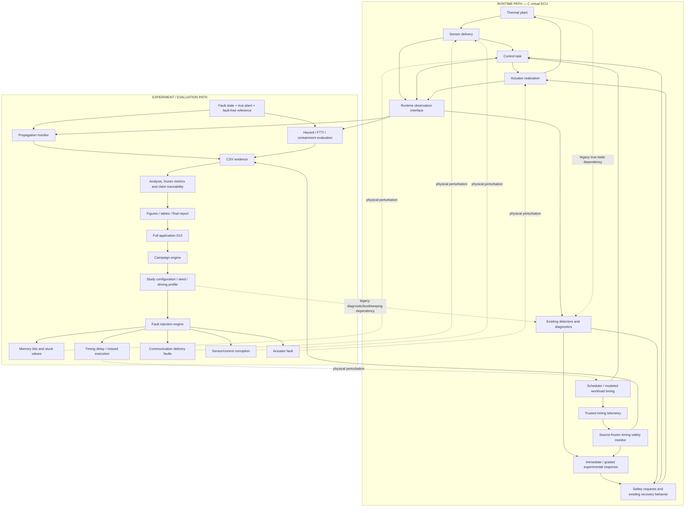

# Canonical cross-layer platform architecture

The C virtual ECU preserves modular sensor, control, actuator, diagnostics, safety,
fault injection and CSV logging components. Python orchestrates studies and analyzes
artifacts; it does not supply a new runtime detector. V6 adds presentation and
provenance around the accepted v5 implementation.

Solid arrows show normal flow or evaluation inputs. Fault arrows identify where
experiment-defined perturbations act. The two legacy dependency arrows deliberately
cross the conceptual boundary: this is not an assertion of full hardware isolation.
The new timing API is a trusted-supervision interface within a simulator.

| Component | Canonical implementation |
| --- | --- |
| Core dispatch / plant / IO | `src/scheduler.c`, `thermal_plant.c`, `sensors.c`, `control.c`, `actuators.c` |
| Injection and communication delivery | `cross_layer_fault.c`, `fault_injection.c`, `sensor_delivery.c` |
| Runtime and timing observation | `runtime_observation.c`, `runtime_timing_observation.c`, `scheduler_stress.c` |
| Existing detection / diagnostics | `detection_algorithm.c`, `diagnostics.c`, `safety_monitor.c` |
| Timing and response | `timing_safety_monitor.c`, `runtime_safety_policy.c`, `safety_policy_v5.c` |
| Ground truth and consequences | `include/experiment_ground_truth.h`, `propagation_monitor.c`, `hazard_model.c` |
| Campaign and analysis | `python/virtual_ecu/cross_layer_campaign.py`, `cross_layer_analysis.py`, `validation_v5_*.py` |
| V6 evidence and orchestration | `final_evidence.py`, `final_reporting.py`, `final_documents.py`, `final_reproducibility.py` |
| GUI | `scripts/virtual_ecu_gui.py`, `cross_layer_gui.py`, `final_validation_gui.py` |

The direct fault dispatcher and optional workload scheduler remain separate. The
latter models legal jitter, queued execution and overload; the two backends cannot
be combined in one run. Neither substitutes host wall-clock time for simulated CPU
occupancy. The thermal model receives between-boundary completions at the next
macrostep and does not simulate substep thermal feedback.

The GUI keeps legacy and v1–v6 loaders separate to preserve historical semantics.
New interactive experiment output is confined to the v6 runtime directory. The
final summary is read from a local generated package and does not require Git-tracked
result files. Missing evidence produces guidance and unavailable fields, not invented
zero metrics. See the [user guide](cross_layer_platform_user_guide.md).
